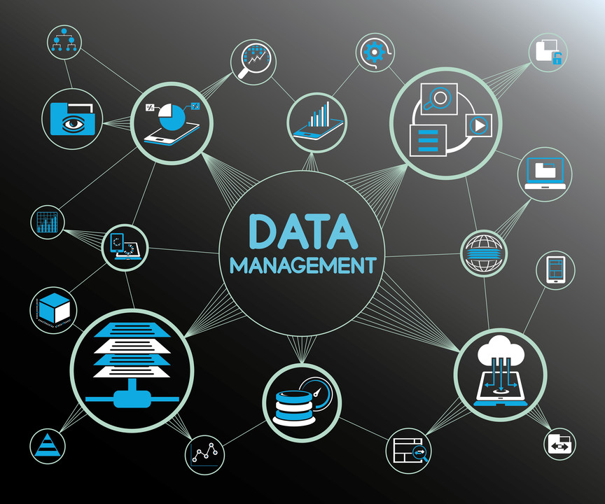
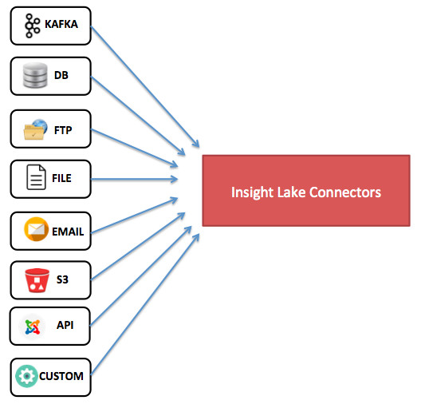
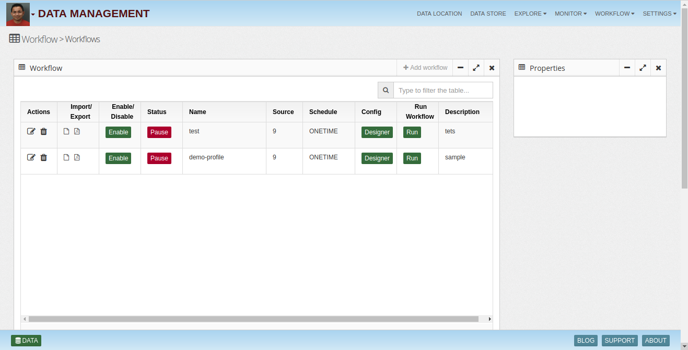
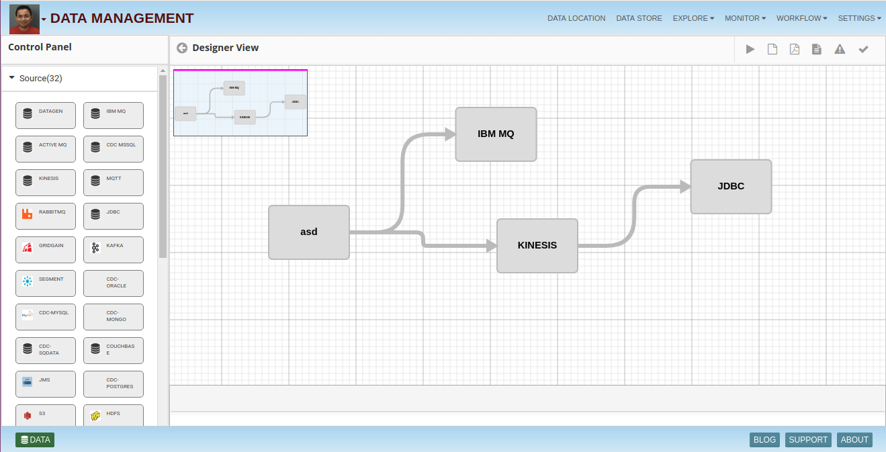
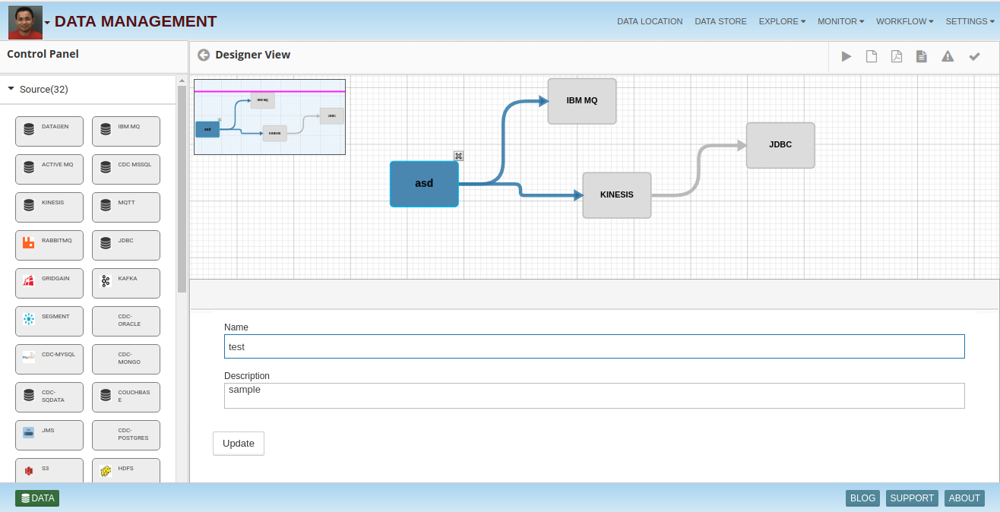
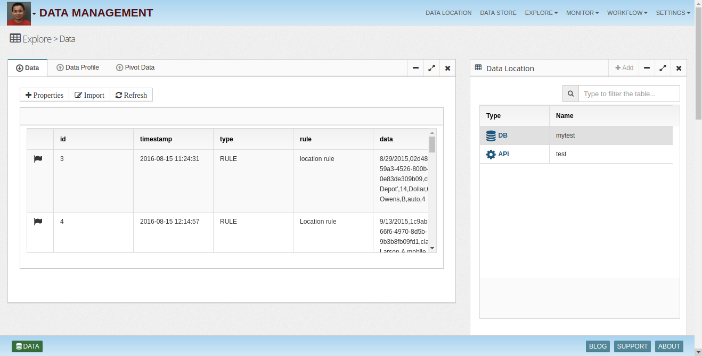
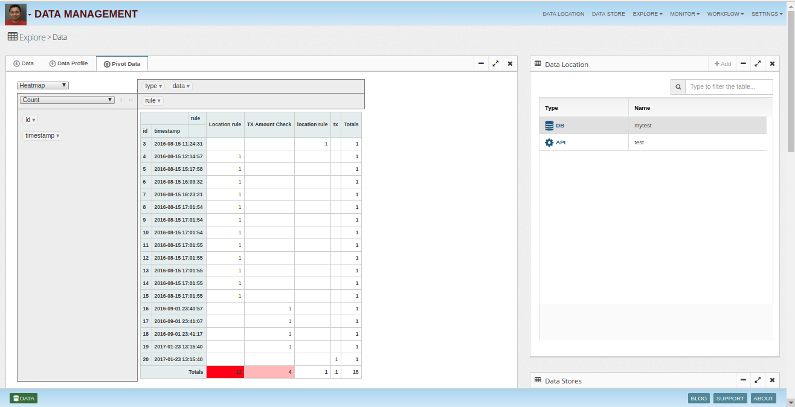
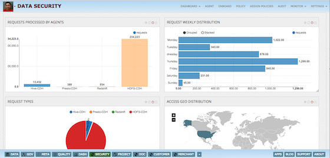
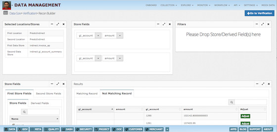

# Data-Management

Insight Lake data management service enables data administrators to ingest data from various sources, validate, standardize, clean, enrich and process to provide value to business users.

Data Management provides following features:

Data ingestion from various sources
Visual designer to create complex data pipelines
Automation of data pipelines & collection of operational metadata
Basic data preparation like Joins, Unions, Transpose and mapping from one format to other
Complex data transformation
Easy data exploration & visualization
Reconciliation for process and data validation
Data adjustment for reporting
Approval workflow
Template migration from DEV to QA to Prod
Version control, Metadata and Data Governance Integration
Prepare and Ingest data
Ingest data in minutes from anywhere and any type without writing code. Prepare, cleanse, and enrich using code-free data wrangler and built-in transformation plugins. Blend data from traditional RDBMS to Data Warehouse to Hadoop

Kafka - Real time streams
DB - Oracle, MySQL...
FTP, SFTP
FILE - Manual upload
Email
S3, HDFS
API
Custom - Build custom connector

## Drag & Drop Visual Data Pipeline Designer
* Workflow

* Designer View

* Designer Properties

Data management service UI provides drag and drop visual designer, where components can be dragged from the palette and connected together to form complex data pipelines.

Data pipeline components are classified in following categories:

Sources - FTP, API, DB, Kafka, HDFS, S3, Files etc
Processor - AWS command, Shell, API
Transformers - Join, Unions, Transpose, Mapping, SQL Commands, Custom Spark
Sinks - FTP, API, DB, Kafka, HDFS, S3, Files etc

Automation
Created data workflows can be scheduled to run always or at specified schedule. Flow explorer shows the running data jobs and their operational data gets captured for Ops teams exploration.

## Explore data

* Data View

* Pivot Table View

Ingested or transformed data stored at any location like Kafka, HDFS, S3, Hive, MySQL, Oracle, SOLR etc can be explored easily using an intuitive data explorer.

Explorer also provides features like highlighting rows/cells, adding tags and notes, which could be used for capturing additional information about data at cell level.

## Visualize

Ingested or transformed data can be easily visualized by creation of dashboards using Dashboard service. Basic charts like Histogram, Pie, Line, Donut, Tables, Maps etc can be easily created. Complex charts like Tree, Summary, Pivot, Linked tables, Force directed graphs can also be used.

Charts could be built on top of any data source like Kafka, Database, SOLR, Elastic Search, Hive etc.

Realtime charts could be used for operational dashboards.

## Data Reconciliation

Data Reconciliation feature enables comparison of two data sets, which results in matching and non matching records. Data reconciliation can be done at various places, for example:

Source to target matching - In a data pipeline end step could be provisioned to check if target data store reflects all the source records. If records match that means data pipeline has properly processed all the records, otherwise something went wrong during the process.
Matching records from different data sources - Data validation/reconciliation can be done between two data sources, which could be built by separate data pipelines.

Data reconciliation can be automated to run at pre defined period to check the data consistency.

Drill down feature allows checkin what parent table records were used in formation of subject table's mismatched record. This helps in finding the gaps easily.

## Data Adjustment
Data adjustment feature allows adjustment/update capability using UI. It also captures audit information like who changed, when, what changed, why change was done and who approved the change.

## Approval Workflow
All changes related to data like data pipeline flows, reconciliation jobs, adjustments etc follow an approval/governance process where data steward/admin reviews and approves the change then only effect is materialized.

## Template Migration
Data management allows migration of data pipeline templates, reconciliation jobs from lower environment to upper like DEV to QA to PROD by following approval process.

To learn more, check out [http://www.insightlake.com/data-management.html](http://www.insightlake.com/data-management.html)

Installation
------
* Download or clone the repository. 
* Run bin/insightlake command.
* Open browser with URL as http://localhost:8080/
* Change configuration in /conf folder to set different ports
* By default H2 database is used, you can change the database details in jdbc.properties file

Installation using docker 
------
* Download or clone the repository. 
* cd /docker
* Run `docker-compose -f docker-compose.yaml up --build`
* Open browser with URL as http://localhost:8080/
* While creating Data Location use below credentials  

        * username : root
        * password : password
        * URL :  jdbc:mysql://mysql:3306/

License
------
InsightLake Data Explorer is a commercial product but distributed to be used freely. Please contact contact@insightlake.com for details.

Getting Help
----------

You can get help easily :
Community - Google Groups
Slack Channel
Twitter
Facebook
Email: contact@insightlake.com
